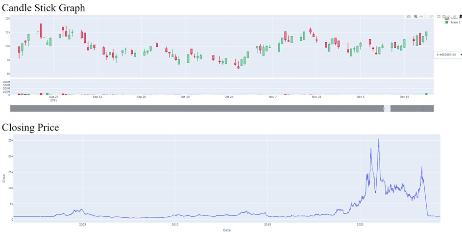

# 📈 StockScraper
A lightweight Python tool to scrape stock data from Iran Stocks.
It fetches real-time stock prices, company details, and market information for easy analysis or integration into trading workflows.

# 🚀 Features
- Scrapes stock prices and company info
- Saves data in CSV/JSON format
- Simple and extensible codebase
- Plot Different Graphs of Stocks

  

